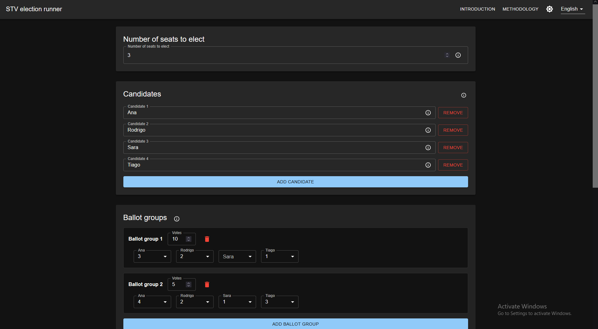

# STV election app

This repo contains a docker image with a website to tally elections using STV.

## What it does



This website runs the Single Transferable Vote (STV) using Meek's method using Droop quota, a precise and widely recognized algorithm for proportional ranked-choice elections.
This is the same type of method used in various real-world governmental and organizational elections.

Main features:

* Candidates are selected (un-ordered) by STV that reproduces [droop.py, the reference implementation of STV](https://prfound.org/2020/05/droop-python-3/);
* Elected candidates are ordered via [Copeland's method](https://en.wikipedia.org/wiki/Copeland%27s_method);
* Frontend allows configuring the election (candidates, ballots);
* Configuration is stored in the url and can be shared;
* Configuration can be loaded and exported to yaml, a human and computer readable format.

## How it does

The underlying algorithm is implemented in open source by [Guillaume Endignoux](https://gendignoux.com/), an engineer at Google.
It can be found [here](https://github.com/gendx/stv-rs) and explained [here](https://gendignoux.com/blog/2023/03/27/single-transferable-vote.html).

By default, STV selects a set of winners, but does not provide a strict ranking of those elected.
To provide a podium-style order, this website augments the STV results by ranking the elected candidates using [Copeland's method](https://en.wikipedia.org/wiki/Copeland%27s_method), a well-known approach based on pairwise comparison of preferences across all ballots.
Specifically, candidates are first selected by STV, and then their order is determined according to voter preferences using Copeland's method.

## How to use

```bash
# Quick start (data will be lost when container stops)
docker run --rm -p 8080:8080 -e RUST_LOG=info ghcr.io/jorgecarleitao/stv-app:main

# Persistent data with volume mount
mkdir -p ./election-data
docker run --rm -p 8080:8080 \
  --user $(id -u):$(id -g) \
  -e RUST_LOG=info \
  -v ./election-data:/app/data \
  ghcr.io/jorgecarleitao/stv-app:main

# open http://localhost:8080 (or proxy TLS-terminated requests to it)
```

### Environment Variables

- `DATABASE_URL` — SQLite connection string (default in container: `sqlite:///app/data/elections.db`)
- `ELECTIONS_DIR` — Path to directory containing election YAML files (default in container: `/app/data/elections`)
- `RUST_LOG` — Log level (default: `info`)
- `FRONTEND_STATIC_DIR` — Path to frontend static files (default in container: `/app/static`)

## How to develop

```bash
cargo test
RUST_LOG=info cargo run
docker build -t test .
```
